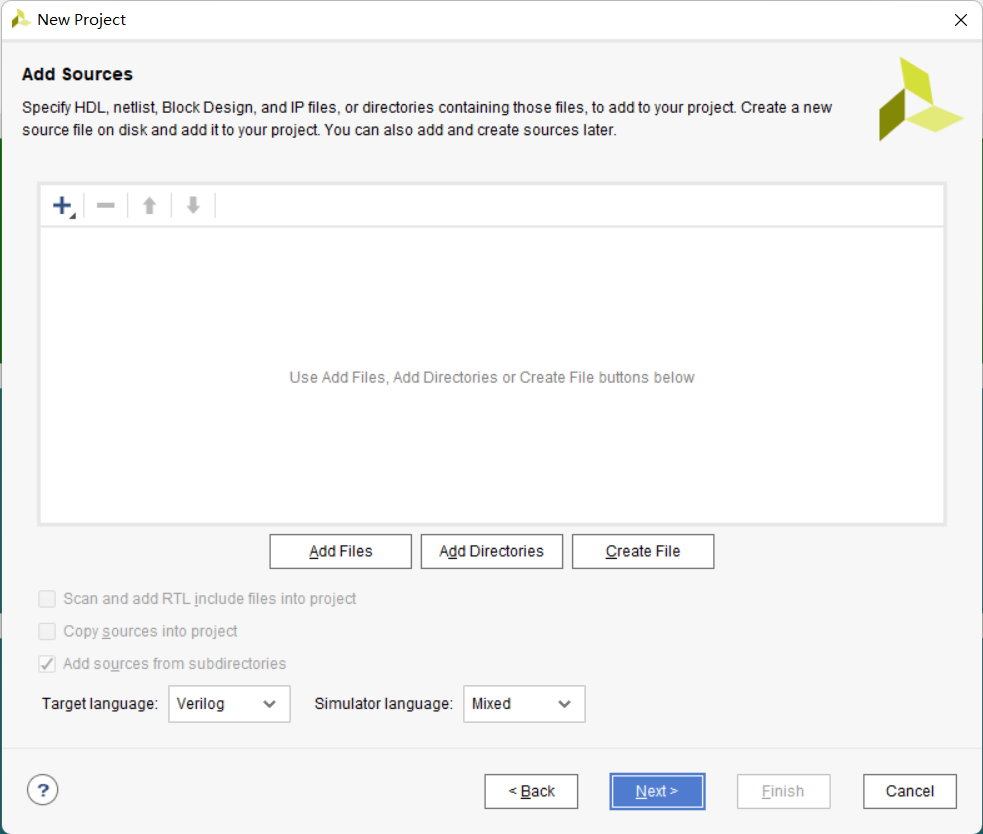

# 南方科技大学CS202/214计算机组成原理课程大作业

[](README_en.md)[](LICENSE)[](https://jq.qq.com/?_wv=1027&k=d02UjNgH)

这是南方科技大学CS202/214计算机组成原理课程的大作业——实现一个CPU。
本项目的基本功能为，实现了基于FPGA和Verilog语言的支持MIPS指令集的单周期中央处理器。

## 编译说明

本项目使用Vivado作为EDA工具，下载代码后可以快速创建可编译的Vivado项目, 步骤如下:

1. 克隆项目到本地

   ```bash
   git clone https://gitee.com/yecanming/SUSTech-CS202_214-Computer_Organization-Project.git
   ```

2. 新建Vivado 项目

   

   选择RTL Project

   

   进入添加代码环节

   

3. 导入verilog源代码（可合成文件）

   点击Add Directories，在弹出来的文件筐中选择ip_invoke（xci文件，用于生成IP核的调用）和mips_cpu（主要的源代码）两个文件夹导入。

   

4. 添加管脚约束文件

   

   找到xdc文件夹。

   

   逐个导入其中所有xdc文件（包括子文件夹中的文件）。

   导入时可以按住ctrl多选，提高效率。

5. 开发板型号选择

   本项目使用Xilinx的Minisys开发板测试，该开发板的设置如下：

   

6. 导入自定义IP核

   这些IP核的源代码在本项目当中，并不是vivado自带的，因此需要导入vivado的IP Catalog。

   我们的项目主要用到了东南大学计算机系提供的串口COE接收IP核，很有帮助，在此致谢。

   首先点击IP Catalog

   

   选择Add Repository

   

   找到ip_import文件夹，直接导入

   

7. 导入Verilog测试（仿真）文件(可选)

   选择Add or create simulation sources

   

   找到test/verilog 文件夹，直接导入文件夹

   

   

## 如何参与开发

1. 克隆项目到本地

   ```bash
   git clone https://gitee.com/yecanming/SUSTech-CS202_214-Computer_Organization-Project.git
   ```

   切换到develop分支

   ```bash
   cd SUSTech-CS202_214-Computer_Organization-Project
   git checkout develop

2. 用喜欢的编辑器修改项目

   - 方法1：用vivado本地工程引用项目，见`编译说明`
   - 方法2：用vscode修改文件

3. 使用喜欢的git管理工具提交更改

   - 方法1：git命令行

     ```bash
     git add . # .表示工作文件夹都被加入（除了gitignore）
     git status # 确认add命令加入的是你想要提交的文件，如果不是，用git reset --soft HEAD^取消git add
     ```

     ```bash
     git commit -m "提交的名字" # 尽量遵守 Commitizen 规范
     ```

   - 方法2：VS Code

   - 方法3：Jetbrains IDE

4. 使用喜欢的git管理工具推送到云端

   - 方法1：git命令行

     ```bash
     git push -u origin develop # 不是master。
     ```

   - 方法2：VS Code

   - 方法3：Jetbrains IDE
