# CS214 期末大作业说明

[toc]

**叶璨铭 测试场景2，CPU全面升级,代码规范 ； 王睿 UART，测试场景2调配； 张力宇 测试场景1，基础CPU组装，基础功能仿真；贡献比平分**

## GIT 
[GITEE连接](https://gitee.com/yecanming/SUSTech-CS202_214-Computer_Organization-Project)
采用gitee进行版本控制，主要是控制设计和仿真文件，约束xdc文件，ip核xci文件，asm和mips 文件。其中每一个文件都放在相对应的文件夹内，在vivado中导入即可快速复现工程。
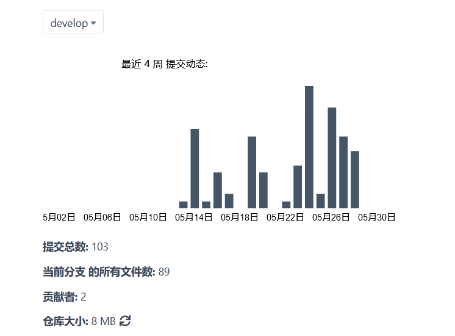
测试环境有效隔离可以更快复现工程，以及多人协作

利用git标签控制，发布release版本，方便进行版本回退
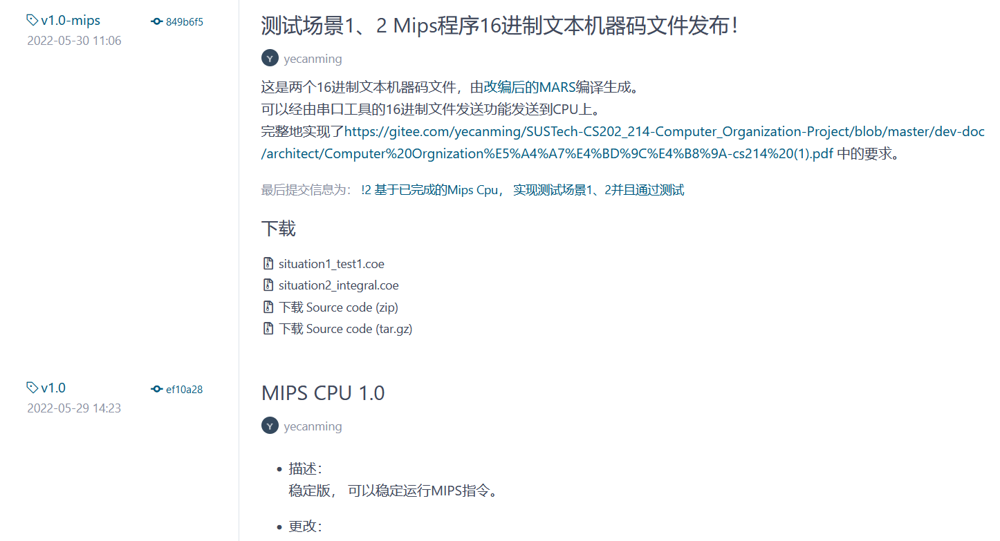

# CPU 特性（按照文档要求）
## ISA
### 基础ISA指令
|我们实现的基础指令集是课件上指出的subset
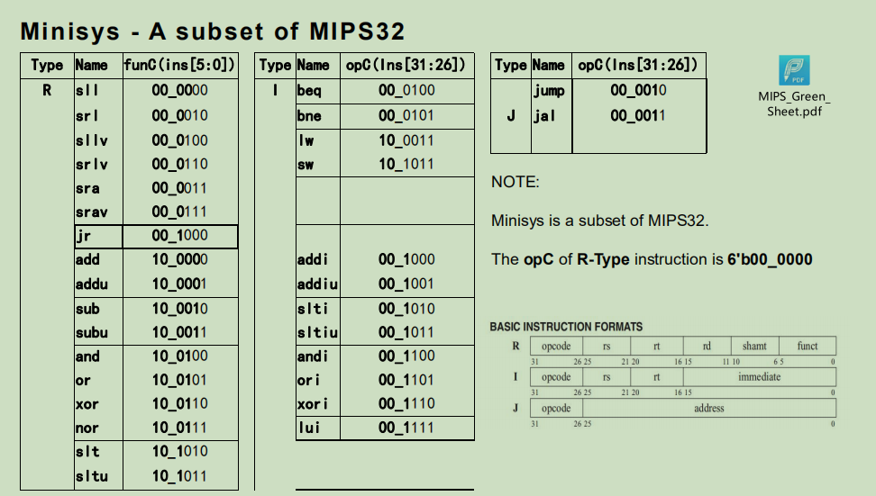
调用方法是按照汇编调用


## 寻址空间设计：

### 哈佛结构，内存地址和指令地址分布于2个模块中
### 指令空间：
[0x0000_0000-0xFFFF_FFFF]
### 数据空间：
[0x0000_0000-0xFFFF_FC00)
### 外设IO寻址范围：
| 设备编号 | 外设名称          | 外设类型 | 约定内存地址1 | 数据类型/行为描述                                            | 备注                    |
| -------- | ----------------- | -------- | ------------- | ------------------------------------------------------------ | ----------------------- |
| 0        | 左灯光(8)         | 输出设备 | 0xFFFFFC62    | 输出的32位数的低比特8位点亮左边的8盏灯                       | 不允许sw                |
| 0        | 右灯光(16)        | 输出设备 | 0xFFFFFC60    | 输出的32位数的低比特16位点亮右边的16盏灯                     |                         |
| 1        | 左开关(8)         | 输入设备 | 0xFFFFFC72    | 输入的32位数的低比特8位为左边的8个开关                       | 不允许lw                |
| 1        | 右开关(16)        | 输入设备 | 0xFFFFFC70    | 输入的32位数的低比特16位为右边的8个开关                      |                         |
| 2        | 左七段数码管(4)   | 输出设备 | 0xFFFFFC82    | 输出的32位数的低比特16位以十六进制显示在左数码管             |                         |
| 2        | 右七段数码管(4)   | 输出设备 | 0xFFFFFC80    | 输出的32位数的低比特16位以十六进制显示在右数码管             |                         |
| 3        | 串口输出(8位)     | 输出设备 | 0xFFFFFC92    | 输入的32位数的低比特8位发送到上位机                          | 未实现                  |
| 3        | 串口输入(8位)     | 输入设备 | 0xFFFFFC90    | 输入的32位数的低比特8位为最新的串口数据                      |                         |
| 4        | 电子琴输出（8位） | 输出设备 | 0xFFFFFCa2    | 输出的32位数的低比特8位按照[2catycm标准电子琴格式](https://github.com/Two-Cats-Software-Organization/SUSTech-CS207-2021Summer-StudyPack/blob/master/project/Digital Design Project Report 12011404 叶璨铭.pdf)解析为音乐并播放。 | 支持36阶半音符，4音轨。 |
### CPI:
CPI = 1
单周期CPU

## CPU接口：
时钟采用开发板自带的时钟接口

复位按钮是S2

UART接口，UART模式切换接口按钮S4

数码管LED，24位拨码开关，24位LED灯

## CPU内部结构
CPU外部的接口的设置
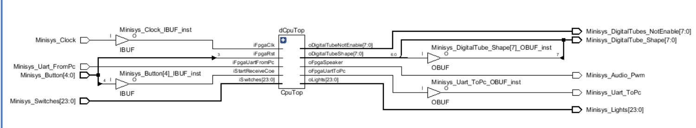

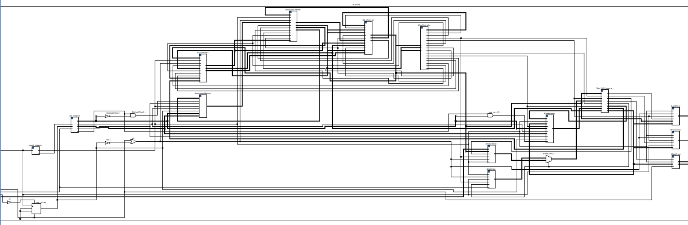

### CPU各子模块的模型

首先是6个核心CPU模块

#### cpuDecoder

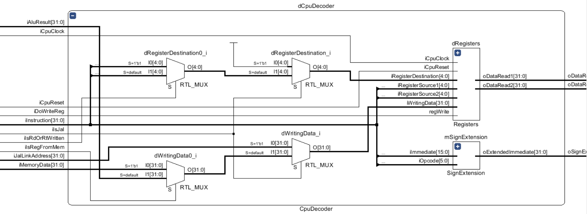

#### InstructionMemory

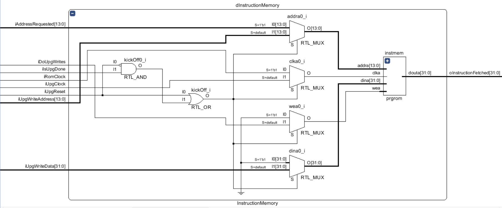

#### DataMemory

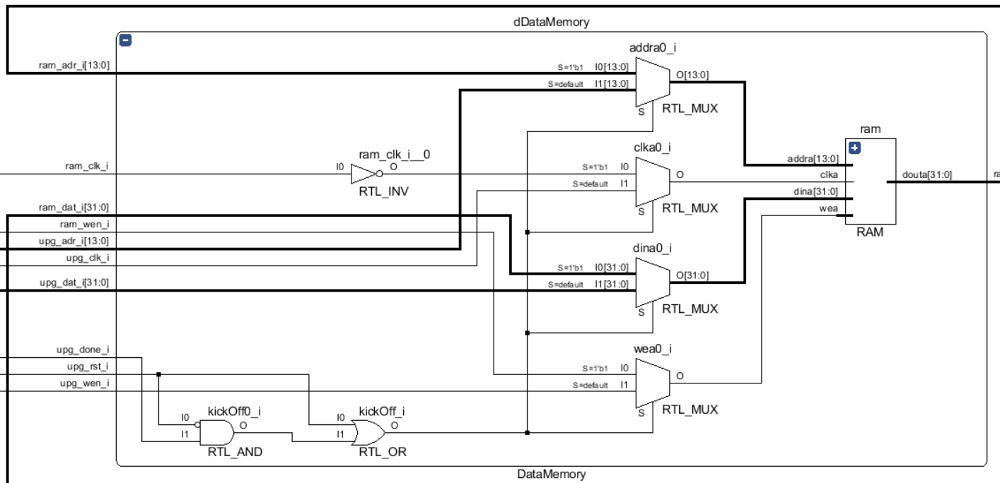

#### CpuController

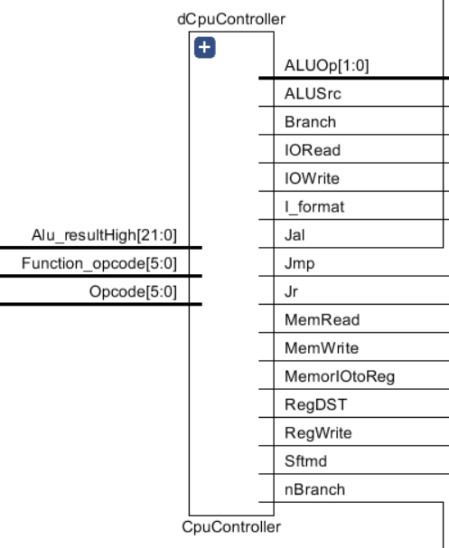

#### InstructionFetcher

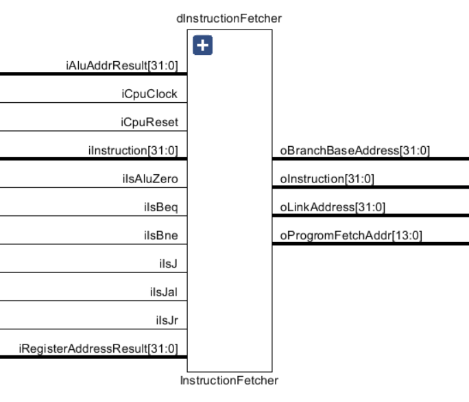

#### CpuExecutor

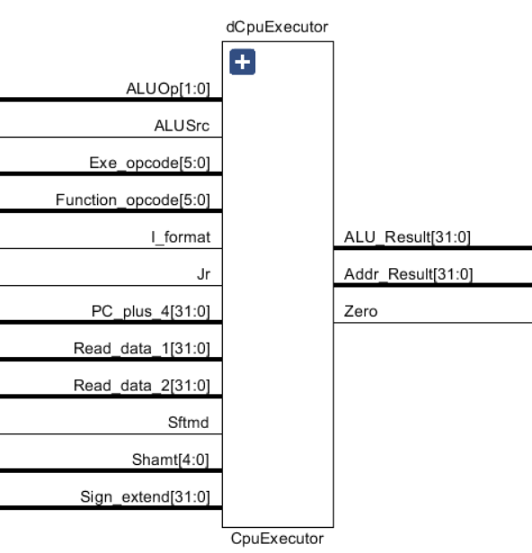

下面是添加的关于IO的管理和一些外设driver模块

#### MemOrIO

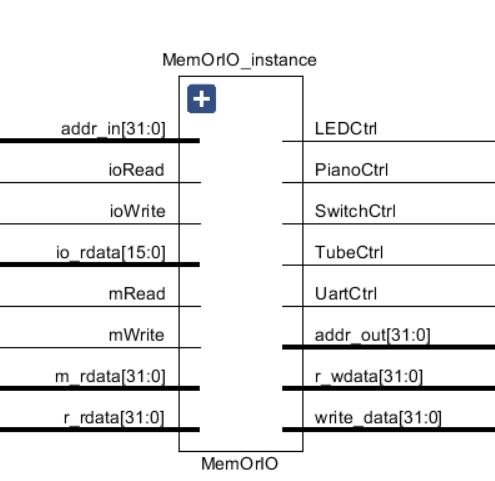

#### 输入外设SwitchDriver

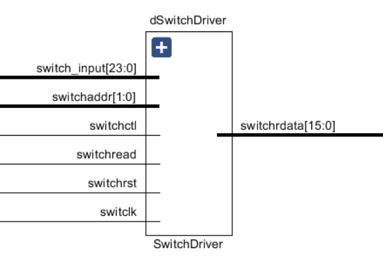

#### 输入外设UartDriver

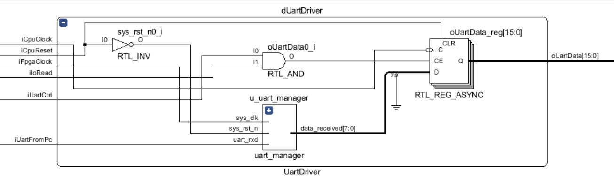

#### 输出外设LightDriver


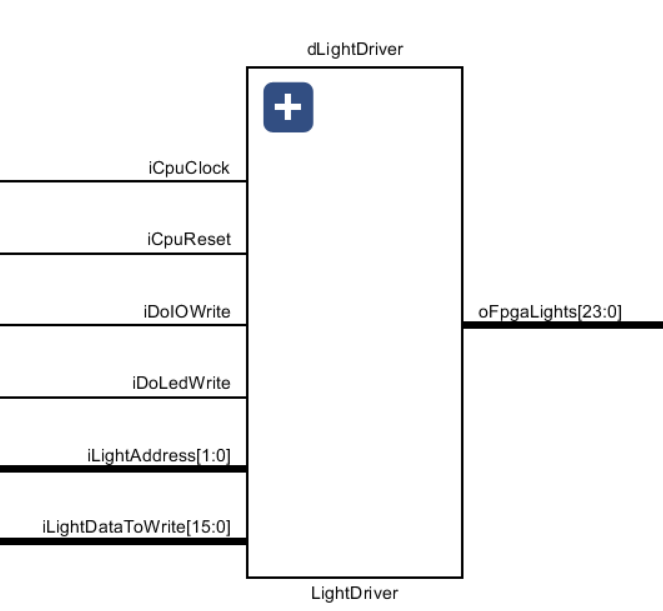

#### 输出外设 PianoDriver

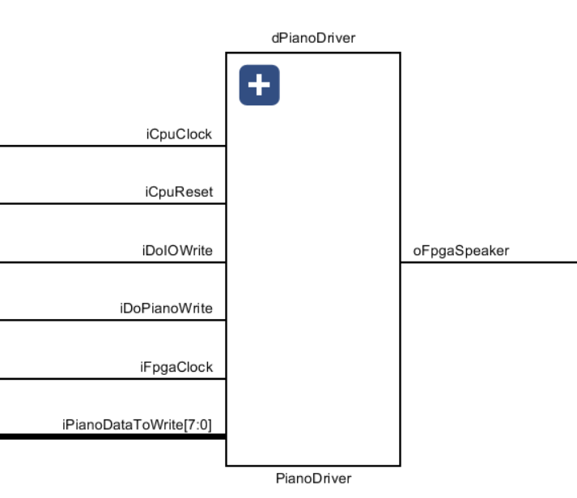

#### 输出外设TubeDriver

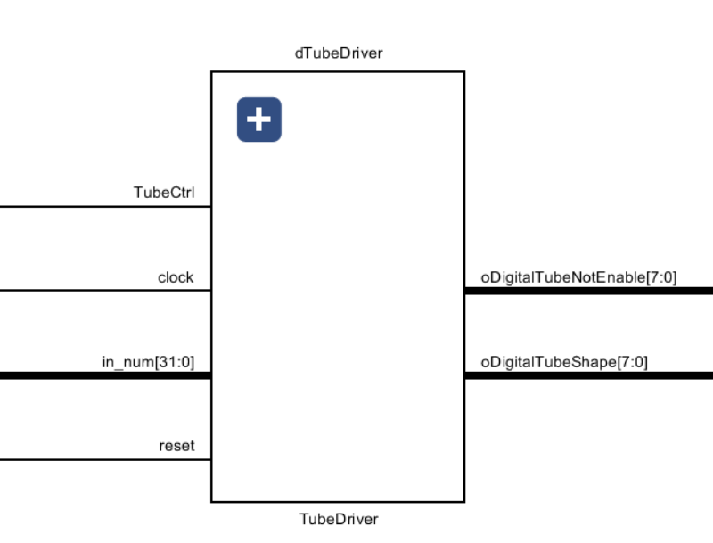

## 测试说明

### vivado模拟测试
|测试方法|测试类型|测试样例描述|测试结果|测试结论|
|--------|-------|----------|---------|-----|
|仿真    | 单元   | 对OJ上分别写的模块进行测试|通过 | 各子模块功能没有问题|
|仿真    |集成    |测试场景1 testSituation1.v（在test路径下verilog文件夹） | 通过 | 基础的指令没有问题|
|仿真    |集成    |测试场景1 testNewSituation1.v（在test路径下verilog文件夹） | 通过 | asm文件没有问题|

### asm和mips测试项目（上板测试）

##### mips测试文件都进行保留，位于test路径的mips文件夹下

- demo_read_swtich_write_led.mips
  - 期望行为：这是最简单的测试场景，当导入到我们的CPU上后，用户按什么按键就会亮什么灯。
  - 验证的硬件功能：lw, sw, j的支持；MemOrIOn模块。
- jal_test.mips
  - 期望行为：右边的16盏灯全亮起来
  - 验证的硬件功能：jal, jr, j, sw的支持；
- demo_flow.mips
  - 期望行为：左边的八个灯每隔1s轮流亮起来，形成流水灯。
  - 验证的硬件功能：jal, jr, j, sw, lw的支持；
  - 验证的软件功能：commons/stdio_minisys.mips 的 sleep, write_control函数。
- situation1.asm
  - 000状态下, 可以及时确定数码管及是否是回文数，001状态下可以保存2个数，保存的数字不会被刷新。具体测试样例：A是1000_0000_0001_1111, B 是0000_0000_0001_0011,值得说明的是110的情况下是0001_1111_1111_1111 ,然后111情况下是算术右移，结果是1111_1111_1111_1111.
- new_situation1.mips
  - 与situation1asm的效果几乎一样，但是是通过后期调用的宏进行重构。
- situation2.mips
  - 在此做一些说明，
  - 比如输入1000_0011(-3，-125),1000_0100(-4,-124)，0000_0000(0，0),0000_0001(1，1),括号里面的值都是原码，然后我们可以看出比如是 101情景，数据集3（补码），下标0，则会输出二进制形式1000_0011（补码最小）.如果101场景，把这个数据集换成1（无符号数），下标3，则会输出二进制形式1000_0100（无符号数最大）
  - 

### 测试状态

- demo_read_swtich_write_led.mips
  - 通过
  
- jal_test.mips
  - 通过
  
- demo_flow.mips
  - 通过
  
- situation1.asm
  - 通过 
  
    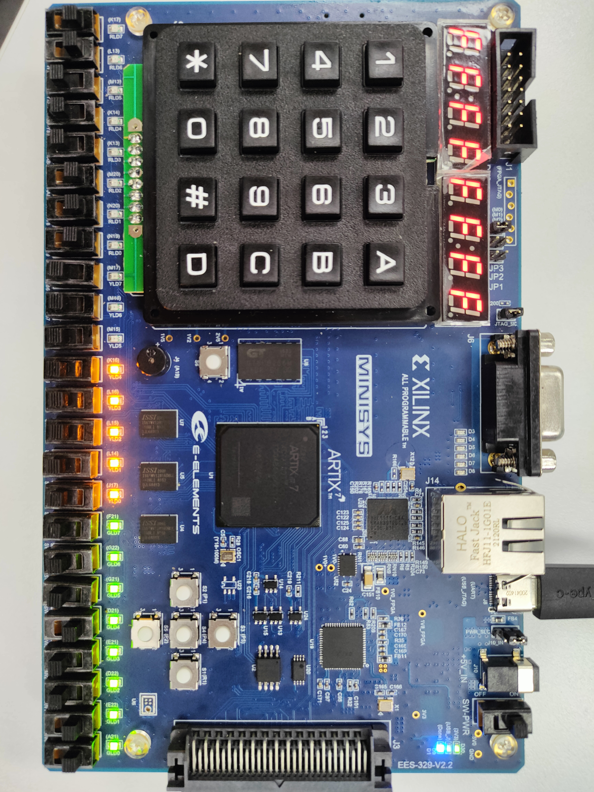
  
    
  
- new_situation1.mips
  - 通过。
  
- situation2.mips
  - 通过。


# 主要特色（讲解可参照BONUS视频）


### 1.基于华为大规模逻辑设计指导书和高通绝密VERILOG 编码规范进行代码重命名和优化，并且总结我们一套的命名规范

课件中的代码命名相对比较难debug，在网上找到华为和高通内部的设计书之后决定对线路命名和线路连线进行完全意义上的重新设计。包括但不限于一下部分：
1.按照驼峰命名法，对于所有input添加i前缀，对于所有的output添加o前缀，这个input和output是对于内部模块来说的。对于模块的例化始终在模块名字之前添加d进行区分。对于连接外设的设备统一添加driver，对于内部设备则尽量以表达明白含义的方式进行命名。
2.一般能不使用中间变量的时候就不使用中间变量，在管脚绑定的时候能通过以下比较简洁的方式书写就通过更加简洁的方式书写。比如如下这种管脚绑定的方式

```
RAM ram (
        .clka (kickOff ? ram_clk : upg_clk_i),
        .wea (kickOff ? ram_wen_i : upg_wen_i),
        .addra (kickOff ? ram_adr_i : upg_adr_i),
        .dina (kickOff ? ram_dat_i : upg_dat_i),
        .douta (ram_dat_o)
    );
```

3.以上仅仅是列举的一小部分规范，具体的规范请参考dev-dov/style 路径下的 Verilog style.md，里面有更加详细的规范说明

### 2.最新CPU架构的UART 串口的巧妙设计

### 3.Pinao 的巧妙设计

## 开发过程的问题及总结

#### 1.vivado和vscode 和GIT 结合的多人合作的方法论

首先要明白的是vivado的源代码文件是可以批量的导入源代码的，对于v文件，肯定是没什么问题的。xdc约束文件也是可以放在一个文件夹里面，然后添加约束文件夹，也可以一键导入。

然后还有比较核心的就是xci的IP核文件，这个也是可以直接导入的，但是注意不同IP核之间要放在不同的路径下。

也正是因为这些一键导入，可以支持vivado和vscode的协作，vscode可以调用第三方插件进行自动生成testbench，或者检查一些低级的错误。

然后vscode还是和GIT的图形化界面的联系IDE。通过VSCODE才可以大家更加方便使用GIT。

在做一些冒险的开发的时候，才可以直接切换一个分支，然后等到功能稳定之后，再把分支切换回来，或者开发不了就永远的把那个分支留在那。

GIT在实操的过程中也会出现因为不熟悉带来的不方便的地方，但是从长远来说，GIT的使用肯定更加方便项目管理。

Vivado建议大家的字体都设置成一样，不同的字体的编码方式是不一样的，在后期我们组出现了中文编码乱码的问题，而且很难切换回去。

可以按照JAVA项目那样， 分成main和test，main底下 分成mips和verilog，test底下也分成这样。

#### 硬件编写的主要事项


