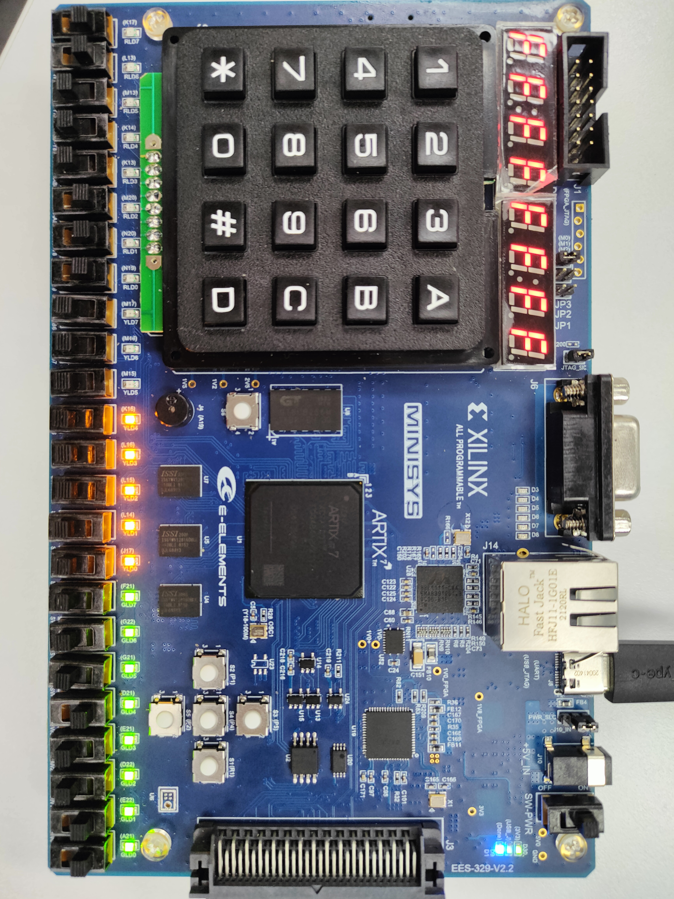

# CS214 期末大作业说明
### 叶璨铭 测试场景2，CPU全面升级 ； 王睿 UART，测试场景2调配； 张力宇 测试场景1，基础CPU组装，基础功能仿真；贡献比平分
## GIT ：
[GITEE连接](https://gitee.com/yecanming/SUSTech-CS202_214-Computer_Organization-Project)
采用gitee进行版本控制，主要是控制设计和仿真文件，约束xdc文件，ip核xci文件，asm和mips 文件。其中每一个文件都放在相对应的文件夹内，在vivado中导入即可快速复现工程。

测试环境有效隔离可以更快复现工程，以及多人协作

利用git标签控制，发布release版本，方便进行版本回退


# CPU 特性
## ISA
### 基础ISA指令
|
### 基于参考的ISA 做出的优化：
#### 基于华为大规模逻辑设计指导书进行代码重命名和优化
课件中的代码命名相对比较混乱，在网上找到华为内部的设计书之后决定对线路命名和线路连线进行完全意义上的重新设计。包括但不限于一下部分：
1.按照JAVA的驼峰命名法，对于所有input添加i前缀，对于所有的output添加o前缀，这个input和output是对于内部模块来说的。对于模块的例化始终在模块名字之前添加d进行区分。对于连接外设的设备统一添加driver，对于内部设备则尽量表达明白含义
2.一般能不使用中间变量的时候就不使用中间变量，在管脚绑定的时候能通过以下比较简洁的方式书写就通过更加简洁的方式书写。
```
RAM ram (
        .clka (kickOff ? ram_clk : upg_clk_i),
        .wea (kickOff ? ram_wen_i : upg_wen_i),
        .addra (kickOff ? ram_adr_i : upg_adr_i),
        .dina (kickOff ? ram_dat_i : upg_dat_i),
        .douta (ram_dat_o)
    );
```
## 寻址空间设计：
### 哈佛结构，内存地址和指令地址分布于2个模块中
### 指令空间：
[0x0000_0000-0xFFFF_FFFF]
### 数据空间：
[0x0000_0000-0xFFFF_FC00)
### 外设IO寻址范围：
| 设备编号 | 外设名称          | 外设类型 | 约定内存地址1 | 数据类型/行为描述                                            | 备注                    |
| -------- | ----------------- | -------- | ------------- | ------------------------------------------------------------ | ----------------------- |
| 0        | 左灯光(8)         | 输出设备 | 0xFFFFFC62    | 输出的32位数的低比特8位点亮左边的8盏灯                       | 不允许sw                |
| 0        | 右灯光(16)        | 输出设备 | 0xFFFFFC60    | 输出的32位数的低比特16位点亮右边的16盏灯                     |                         |
| 1        | 左开关(8)         | 输入设备 | 0xFFFFFC72    | 输入的32位数的低比特8位为左边的8个开关                       | 不允许lw                |
| 1        | 右开关(16)        | 输入设备 | 0xFFFFFC70    | 输入的32位数的低比特16位为右边的8个开关                      |                         |
| 2        | 左七段数码管(4)   | 输出设备 | 0xFFFFFC82    | 输出的32位数的低比特16位以十六进制显示在左数码管             |                         |
| 2        | 右七段数码管(4)   | 输出设备 | 0xFFFFFC80    | 输出的32位数的低比特16位以十六进制显示在右数码管             |                         |
| 3        | 串口输出(8位)     | 输出设备 | 0xFFFFFC92    | 输入的32位数的低比特8位发送到上位机                          | 未实现                  |
| 3        | 串口输入(8位)     | 输入设备 | 0xFFFFFC90    | 输入的32位数的低比特8位为最新的串口数据                      |                         |
| 4        | 电子琴输出（8位） | 输出设备 | 0xFFFFFCa2    | 输出的32位数的低比特8位按照[2catycm标准电子琴格式](https://github.com/Two-Cats-Software-Organization/SUSTech-CS207-2021Summer-StudyPack/blob/master/project/Digital Design Project Report 12011404 叶璨铭.pdf)解析为音乐并播放。 | 支持36阶半音符，4音轨。 |
### CPI:
CPI = 1
单周期CPU
## CPU接口：
时钟采用开发板自带的时钟接口

复位按钮是S2

UART接口，UART模式切换接口按钮S4

数码管LED，24位拨码开关，24位LED灯

## CPU内部结构
## 测试说明
### vivado模拟测试
|测试方法|测试类型|测试样例描述|测试结果|测试结论|
|--------|-------|----------|---------|-----|
### asm和mips测试项目

- demo_read_swtich_write_led.mips
  - 期望行为：这是最简单的测试场景，当导入到我们的CPU上后，用户按什么按键就会亮什么灯。
  - 验证的硬件功能：lw, sw, j的支持；MemOrIOn模块。
- jal_test.mips
  - 期望行为：右边的16盏灯全亮起来
  - 验证的硬件功能：jal, jr, j, sw的支持；
- demo_flow.mips
  - 期望行为：左边的八个灯每隔1s轮流亮起来，形成流水灯。
  - 验证的硬件功能：jal, jr, j, sw, lw的支持；
  - 验证的软件功能：commons/stdio_minisys.mips 的 sleep, write_control函数。
- situation1.asm
  - 000状态下, 可以及时确定数码管及是否是回文数，001状态下可以保存2个数，保存的数字不会被刷新。具体测试样例：A是1000_0000_0001_1111, B 是0000_0000_0001_0011,值得说明的是110的情况下是0001_1111_1111_1111 ,然后111情况下是算术右移，结果是1111_1111_1111_1111，
- new_situation1.mips
  - 如project文档所述。
- situation2.mips
  - 如project文档所述。

### 测试状态

- demo_read_swtich_write_led.mips
  - 通过
- jal_test.mips
  - 通过
- demo_flow.mips
  - 通过
- situation1.asm
  - 通过 
  - 
  - 
- new_situation1.mips
  - 通过。需要review。
- situation2.mips
  - 编写中。
### 测试场景1：
使用第一版的asm代码（第二版asm代码有使用宏定义和开机特效）


