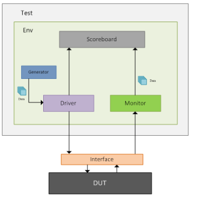
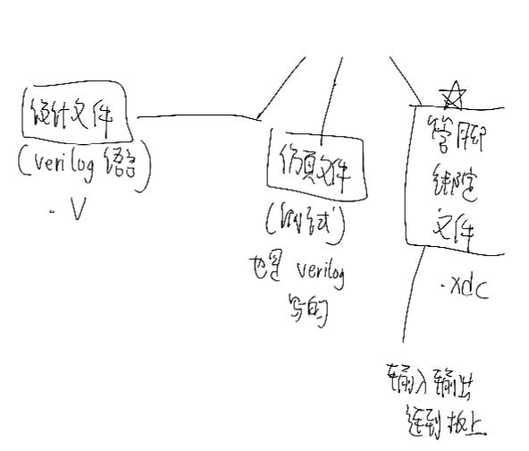
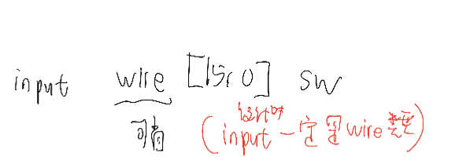

## 计算机组成原理实验8

叶璨铭， 12011404@mail.sustech.edu.cn

[TOC]

### 1. Verilog recap

#### 1.1 基础概念

1. 什么是test bench？

   - bench
     - =workbench : a long heavy table used for doing practical jobs 工作台
     - 长凳
     - 法官 = judge
   - test bench 测试平台。
   - 是一种模拟平台，产生了input stimulus，来对系统进行仿真，从而验证系统的功能。
   - 例子：gazebo对机器人系统仿真、expresso test对安卓应用仿真、Verilog对Verilog仿真。
   - ~~软工观点：黑盒测试？灰盒测试？mock？~~
   - 和软件测试的区别？最小测试单元是module，而不是函数。

2. 什么是Design under test？

   首先是名词，是个**Design**，**不是动词**。其次后置定语under test修饰它。

   是testbench的组成部分，

   - testbench包括了
     - simulator
     - design under test
     - markerboard[^2]
   - 分得更细一点，也可以认为组成部分是这样[^1]

   

3. 什么是system Verilog，和普通Verilog什么关系？

   System Verilog是Verilog的一个标准，类似于ANSI C和C语言的关系。

   System Verilog相对较新。

   专用集成电路（ASIC）是Verilog的主要领域。

4. 设计范式

   门电路设计、数据流设计、行为描述设计。

   

#### 1.2 Verilog/Vivado 开发流程快速回忆

- 三种文件



- 简单的module helloworld

  ```verilog
  module SetBit(
      input [15:0] switches,
      output [15:0] lights
  );
      wire [15:0] lights; //optional restatement of input output. 
      wire [15:0] middle;
      assign middle = switches;
      assign lights = middle;
  endmodule
  ```

  ```verilog
  module test_hello_world(); //也可以没括号
      reg [15:0] switches = 0;
      wire [15:0] lights;
      SetBit set_bit(switches, lights);
      initial begin
          #5 switches = 16'hFE24;
          if (lights!=switches) begin
              $display("Assertian failed. ");
          end
          else begin
              $display("Test passed. ");
          end
          #1000 $finish;
      end
      always #10 switches+=1;
  endmodule //test_hello_world
  ```

- 怎么手动写约束：synthesized design

  - IO/Planning

- Icarus Verilog 流程

  ```bash
  iverilog -o "xx.o" "xx.v" "xxx.v"
  ```

  ```bash
  iverilog -o "xx.o" -y "module directory" "xx.v" # 调用了其他文件的模块
  ```

  ```bash
  iverilog -o "xx.o" -I "include directory" "xx.v" # `include语句
  ```

   ```bash
   vvp -n "test_hello_world.o" -lxt2
   gtkwave hello_wave.vcd
   ```

  iverilog可以类似于安卓里面的jvm测试，然后vivado用来搞类似于expresso test这种依赖系统的测试。

#### 1.3 Verilog 语法快速回忆

- 

  - **仿真时对input的输入是reg。但是模块内部input是wire。**

- 

- 块中被赋值的变量必须是reg类型

- 时序逻辑的两种范式

  - FSM

- 常数

  - -在前、_分割数字
  - 二、八、十六、十四大进制的支持。
  - 自动位宽为32位。
  - **负数必须指定位宽，否则补码可能有问题（自动是32位）**
  - 不足位宽为低比特位。

- 数据类型（限定符）

  - reg
    - 存储单元，保持原有的值，知道被改写。
  - wire
    - 可以有默认值（可以初始化）。没写就是Z，类似于null。
    - 表示物理连线
  - ~~仿真的时候是软件，我们可以和C语言类比~~
    - reg和wire都是左值。
    - wire是constexpr？不对，值可以被修改，只是不可以被我这个作用域修改，可以被底层的模块修改。
    - reg是普通变量。

- 信号拼接

  - ```verilog
    assign temp1 = {byte1[7:0], data1[31:8]}; 
    assign temp2 = {32{1'b0}};  //生成32个0
    ```

- 阻塞赋值与非阻塞赋值。

  - 在仿真中，非阻塞赋值属于并行执行语句，即下一条语句的执行和当前语句的执行是同时进行的。
  - 在设计电路时，always 时序逻辑块中多用非阻塞赋值，always 组合逻辑块中多用阻塞赋值
  - 电路中交换两个值可以做到并行，Verilog实现就是时序逻辑中时钟上升沿非阻塞赋值a<=b b<=a。

#### 1.4 没学懂的语法探索

- `timescale

  - 情景：`timescale 1ns/1ps是什么意思，什么情况下要怎么改?
  - **1ps是仿真最小时间单元**。**1ns是#100时延的单位。**
  - 如果我写了#3.1415926535,就会换算为ps保留一定精度。
  - **`类似于C语言的#，是编译指令。**

- 四种值

  - x为不确定。实际电路中可能是1或者0
  - z是高阻，没有被信号驱动就是z。

- 算术表达式和C语言的区别到底是什么？

  - 支持**，可以像Python一样求幂。
  - 逻辑判断：
    - ==和!=比较出现x或者z，变成x。
    - ===和!==就是考虑x和z为正常的值，直接比较。
  - 逻辑计算：
    - ~^同或
  - 规约操作：&A是把A所有位都&一遍，可以用于判断是不是全1。
  - 移位
    - 逻辑右移logically和算术右移arithmetically。
    - 算术右移补1，根据补码的性质，保持了除2的性质。
    - C语言>>1一定是/2. 有符号整数是算数右移，无符号整数是逻辑右移。

- **parameter**认知

  - parameter不是常数！实例化可以改。
  - 类似于const 函数有默认值参数。
  - localparam 是真的常数。
  - 因为是常数，类型可以自动推断。

- wire与reg认知

  - **reg** [0:31] a和 **reg** [31:0] a的区别

    - 前者是大端序，后者是小端序。
    - 原则是[]的左边是significant的，右边是不significant的。

  -  wire

    - 可以有默认值（可以初始化）

    - 例如

      ```verilog
      wire [9:0] data_low = data[0:9] ; //大端序改为小端序，值不变。
      wire [9:0] data_low = data[0+:10] ; 
      ```

    - 其中 +:8表示递增**直到达到位宽是10**.

- 数组、实数、字符串、时间类型

  - **integer** j 可以用来for，辅助生成数字电路
  - real i 是
  - time t;  t = $time
  - 数组
    - **wire** [7:0]    addr_bus [3:0]
    - 表示数据类型是8bit，但是有0123这4个。
    - integer a[2:0] 表示类型是integer，有3个。
    - **wire** [2:0] data_bit\[7:0]\[5:0], 类型是3bit，衍生类型是二维数组。

参考了[1.1 Verilog 教程 | 菜鸟教程 (runoob.com)](https://www.runoob.com/w3cnote/verilog-tutorial.html)。

## 2. MIPS CPU设计资源汇总

- 学长代码（基础功能）
  - https://github.com/Certseeds/CS202_Computer_Organization.git
  - [Gogomoe/SUSTech_CS202_works: Solutions of exercises in Computer Organization in SUSTech. (github.com)](https://github.com/Gogomoe/SUSTech_CS202_works)
  - [Sustech-yx/Sustech-CS202-Work: The works in Computer Organization Principle (github.com)](https://github.com/Sustech-yx/Sustech-CS202-Work)
- 做了bonus的学长代码
  - [lkpengcs/CS202_CPU_Project at b6b40b5d8ccafc9c13b4d9cd6848693b92c1466a (github.com)](https://github.com/lkpengcs/CS202_CPU_Project/tree/b6b40b5d8ccafc9c13b4d9cd6848693b92c1466a)
    - 运行了CPU挖矿程序。
- RISC-V
  - [RISC-V 指令概况 - 计算机组成原理（2021年） (tsinghua.edu.cn)](https://lab.cs.tsinghua.edu.cn/cod-lab-docs/labs/4-riscv-inst/)
- 其他

[计算机系统综合课程设计3-CPU设计.ppt (book118.com)](https://max.book118.com/html/2017/0513/106523418.shtm)

[Minisys开发板管脚映射 - 数字逻辑设计（2021秋季） | 哈工大（深圳） (gitee.io)](https://hitsz-cslab.gitee.io/diglogic/map/)

## 参考文献

[^1]: [SystemVerilog TestBench (chipverify.com)](https://www.chipverify.com/systemverilog/systemverilog-simple-testbench)
[^2]: [testbench_百度百科 (baidu.com)](https://baike.baidu.com/item/testbench/9222655)
[^3]: [1.1 Verilog 教程 | 菜鸟教程 (runoob.com)](https://www.runoob.com/w3cnote/verilog-tutorial.html)

